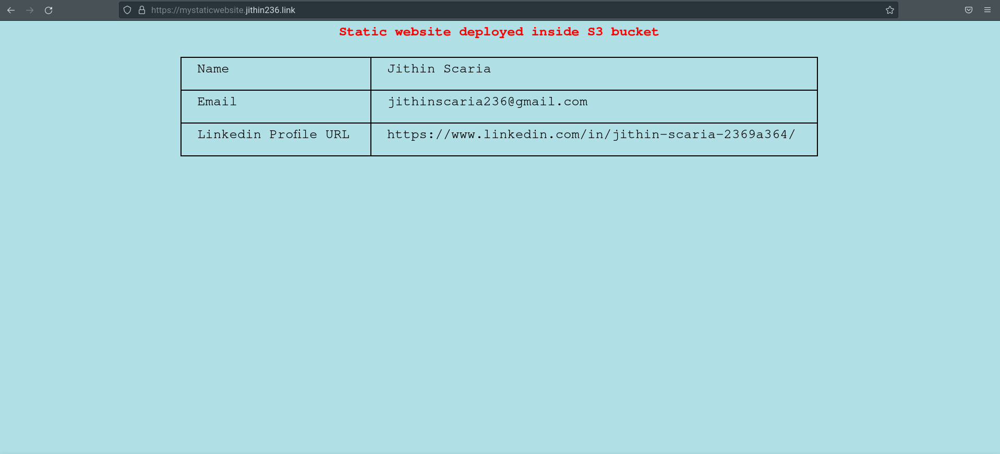

### Static Website Hosting Using S3  and Terraform code

Using this solution we can deploy a static website using the terraform code and S3 bucket
### AWS Services Used
* AWS S3
* AWS Route53
* AWS Cloudfront
* AWS ACM


### Steps for deploying the solution

```sh
git clone https://github.com/jithinscaria236/jithin-s3-static-website.git
```

```sh
cd jithin-s3-static-website
cd static-website-module
```
```sh
terraform init
```
```sh
terraform plan
```

```sh
terraform apply --auto-approve
```
### Sample Screenshot of website

 

```sh

